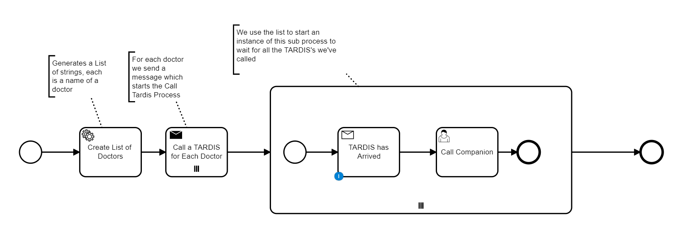
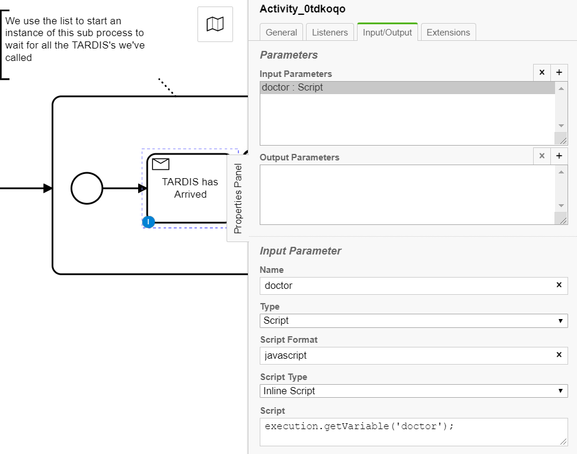
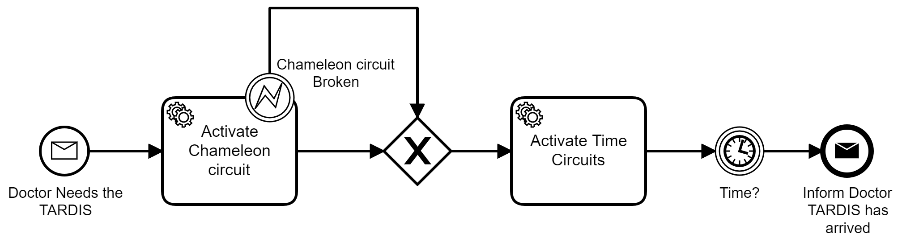
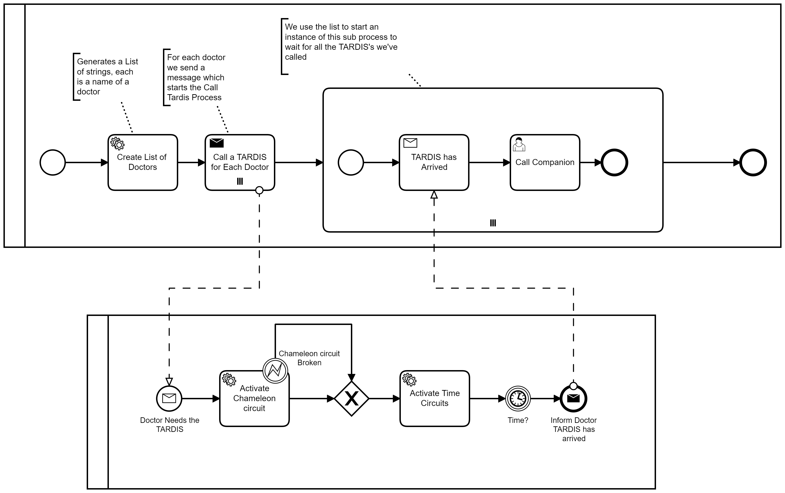

# Multi Instance messages between processes (Example)

This is a simple example which shows how you can start multiple processes with BPMN messages and then waiting for multiple responses back from each of the instances that have been started.
This is a Spring Boot project using the Camunda engine in which the logic written in Java and two independent BPMN processes are uses to progress state and facilitate messaging.


## Doctor Process

The use case here is where we have a list of doctors, each calling their own TARDIS. This results in a new process being called for each doctor and then the process waits for all TARDIS's to respond for each doctor before continuing.




First a list is created with all of the doctors and the list is put into the process context.

```java
List<String> doctors = new ArrayList<String>();

     doctors.add("Tennant");
     doctors.add("Jodie");
     doctors.add("Capaldi");
     doctors.add("Smith");

delegateExecution.setVariable("doctors", doctors);
```

Then for each element of the list a message is sent which starts and instance of the TARDIS process.
Each element of the list is created as a local variable - so it must be taken out of the local context

```java
String doctor = (String) delegateExecution.getVariableLocal("doctor");
```

The message is sent with a payload of ``BussinessKey`` and ``doctor`` in order to ensure we can communicate back to the right message event.

```java
 delegateExecution.getProcessEngineServices()
         .getRuntimeService()
         .createMessageCorrelation("NEED_TARDIS")
         .setVariable("BusKey", delegateExecution.getBusinessKey())
         .setVariable("doctor", doctor)
         .correlate();

```

After all of the messages are sent and the processes have started, the same list of ``doctors`` is used to created a multi sub-process in which we can wait for the responses.

A very important thing to note is how the ``Receive Task`` works. It takes the ``doctor`` variable as an input parameter on the task to ensure that each of the waiting messages are waiting for their own unique return message.



## TARDIS process

This process begins with a message event from the doctor process - it then runs some Java classes before eventually sending a response back to the process that called it.



The process runs some code which throws a BPMN error (just for flavor :) ) and then goes on to calculate a time in which it will wait before responding. it'll calculate a time between 5 and 35 seconds.

```Java

Random timeLord = new Random();
int waitTime = timeLord.nextInt(30) + 5;

delegateExecution.setVariable("timeyWimey", "PT"+waitTime+"S");

```

After the time expires it will use the payload received from the doctor processes i.e. ``BusKey`` and ``doctor`` to send back a message to waiting message catch event.

```Java
String BusKey = (String) delegateExecution.getVariable("BusKey");
       String doctor = (String) delegateExecution.getVariable("doctor");

       delegateExecution.getProcessEngineServices()
               .getRuntimeService()
               .createMessageCorrelation("TARDIS")
               .processInstanceBusinessKey(BusKey)
               .localVariableEquals("doctor", doctor)
               .correlate();
```

After the message is sent successfully, the process ends.

## Message Flow

Despite the two processes being completely independent, we can visualize Communicaiton between the two in this BPMN diagram.


